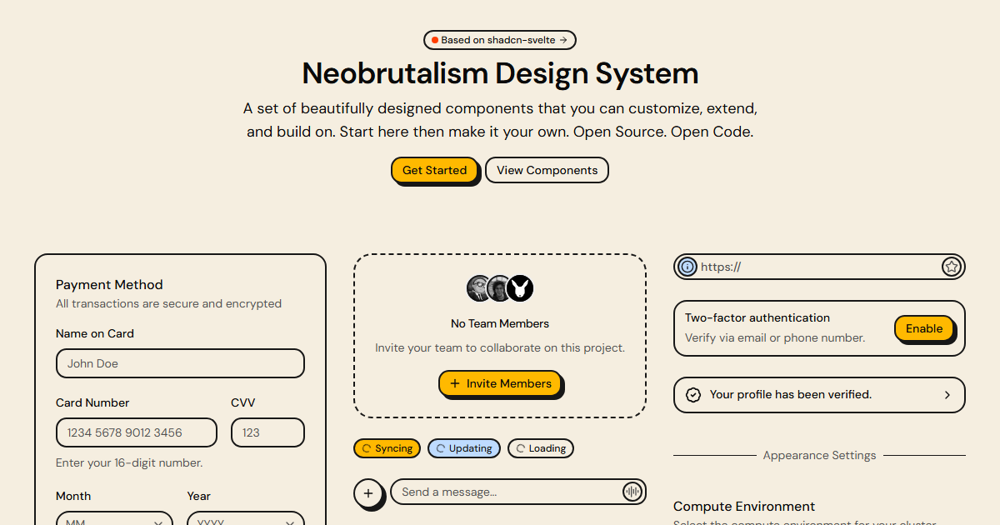

# neobrutalism-svelte

A collection of UI components for Svelte with the neobrutalism design style, based on [shadcn-svelte](https://www.shadcn-svelte.com).

Docs and component previews: **[neobrutalism-svelte.flenze.com](https://neobrutalism-svelte.flenze.com)**

[](https://neobrutalism-svelte.flenze.com)

Built with [shadcn-svelte-registry-template](https://github.com/olegpolin/shadcn-svelte-registry-template).

## Usage

Components are distributed through a shadcn-svelte registry, so you add them to your own SvelteKit app with the shadcn-svelte CLI:

```sh
npx shadcn-svelte@latest add https://neobrutalism-svelte.flenze.com/r/button.json
```

See the [installation guide](https://neobrutalism-svelte.flenze.com/docs/installation) for the full setup (theme and fonts), and each component's docs page for its add command.

## Developing

This section is for working on the library itself.

Install dependencies with `npm install`, then start the docs site:

```sh
npm run dev
```

To build the registry JSON files in `static/r` from `registry.json`:

```sh
npm run registry:build
```

## Building

To create a production version of the docs site:

```sh
npm run build
```

This also runs the registry build script.

You can preview the production build with `npm run preview`.
